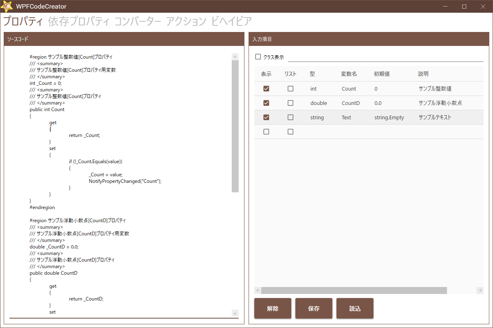
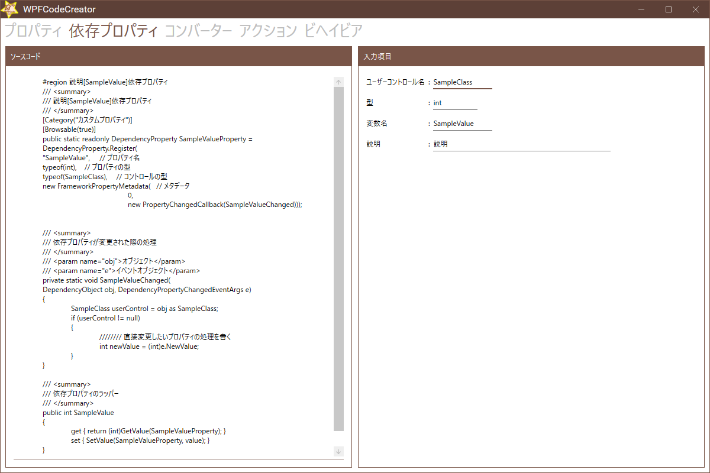
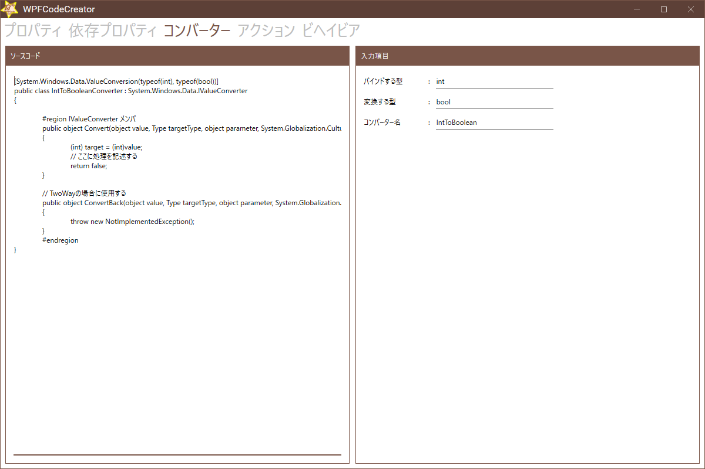
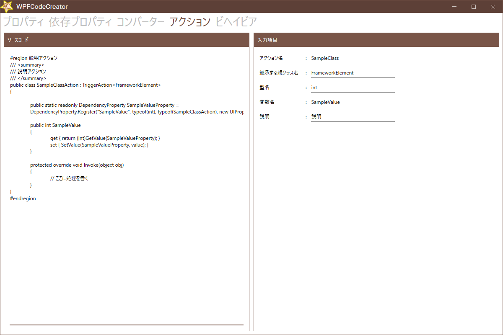
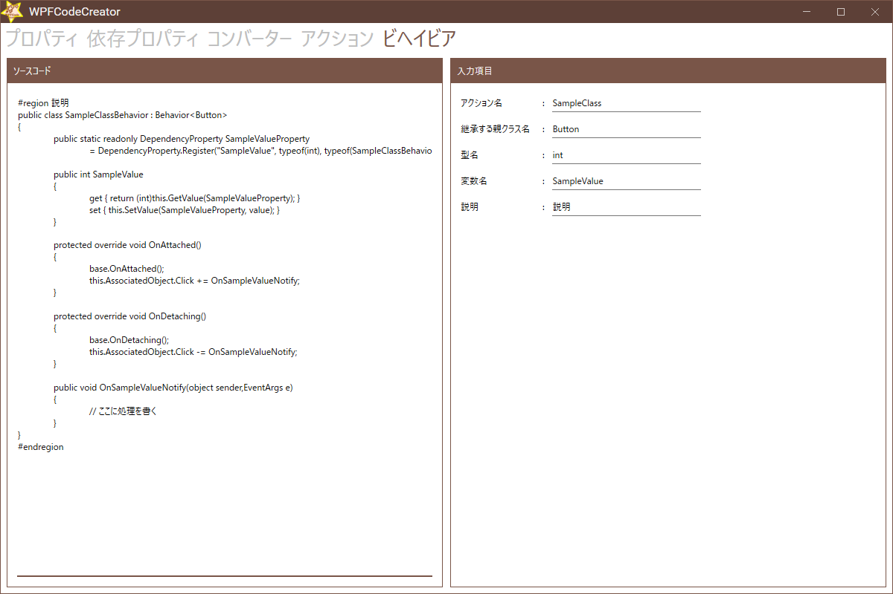

# WPFCodeCreator

WPFCodeCreatorはC#/WPFの開発時に
プログラムの書き方が面倒なものを
サポートすることを目的としています。

例えば以下のようなものを想定しています。

- プロパティ
- 依存プロパティ
- コンバーター
- アクション
- ビヘイビア

## 画面イメージ

### プロパティ

### 依存プロパティ

### コンバーター

### アクション

### ビヘイビア

## インストール

以下のURLから、Latest Releaseのインストーラをダウンロードします。
解凍後、WPFCodeCreatorInstaller.msiを実行し、
画面の案内に従ってインストールします。

https://github.com/zeikomi552/WPFCodeCreator/releases

※必要に応じて.NET5をインストールしてください。

## フィードバック

- [プログラマーやめました](https://www.premium-tsubu-hero.net/)
- [Twitter](https://twitter.com/Zeikomi552)
- [Issues](https://github.com/zeikomi552/WPFCodeCreator/issues)

## ライセンス

Copyright (c) Zeikomi552@プログラマーやめました All rights reserved.

Licensed under the MIT license.

以上